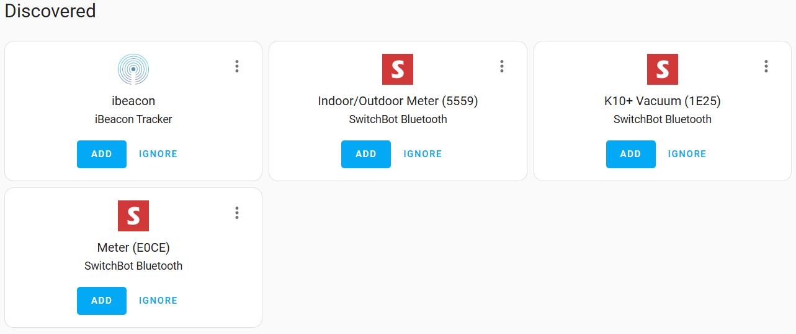

# Bluetooth Proxy Stick for Home Assistant

## ⚠️ Note this project is a work in-progress right now, expect to be completed by end September 2025. 

<table border="0">
  <tr>
    <td><a href="docs/setup">Setup</a></td>
    <td><a href="docs/configuration">Configure</a></td>
  </tr>
</table>

This is a Bluetooth (BLE) Proxy for Home Assistant which does not need a cable, so gone are the days with trying to make excess cable look tidy!

We know alot of homes these days have USB sockets everywhere from being on wall power sockets, behind your TV, on your Xbox, your internet router or a spare socket on a power extension lead, this device lets you plug in the Bluetooth Proxy straight into those for a cable free look. We have designed it to be as small as possible so it's discreet in your home.

Add Product images here
  
  

  Add ebay url here

### Why do I need a Bluetooth Proxy?
- A Bluetooth Proxy connects to your Home Assistant server via Wi-Fi allowing you to position it nearer to your Bluetooth devices 
- You can integrate Bluetooth devices into Home Assistant, such as Switchbot devices that communicate over Bluetooth
- Many devices you can purchase offer their initial setup via Bluetooth BLE even if they don't communicate using it afterwards. BLE enables very easy setup of devices on Home Assistant.
- You can extend the range of Bluetooth in your house with multiple proxies
- With multiple Bluetooth Proxies you can use the <a href="https://github.com/agittins/bermuda">Bermuda</a> or <a href="https://espresense.com/home_assistant">ESPresence</a> integrations in Home Assistant to track Bluetooth devices that move around your home

### Automations you could do
- With Bermuda for example you could:
  - Have your Home Assistant dashboard on your phone automatically adjust depending on which room you are in
  - Attach ibeacon trackers to your waste and recycling bins and know if they have been put out for collection or are still sat in their usual spot.
  - Attach an ibeacon to your keys and know which room you left them in
    
- The ESP32 LED light is exposed to Home Assistant allowing for use in automations such as:
  - Turn blue if the recycling bin has not been put out for collection yet.
  - Turn green if the waste/trash bin has not been put out for collection yet.

### Specs
- The device itself uses an ESP32-C3 chip that is powered by the built in USB port, no external USB cable is needed to power it.
- The firmware of the Bluetooth Proxy is based on ESPHome and flashed with version 2025.8.2 or higher (which has Bluetooth stability improvements).
- Wi-Fi protocol used is 2.4ghz.
- Initial setup of the device to connect it to Wi-Fi can be done using USB, or Bluetooth (if you use Home Assistant and already have a Bluetooth proxy).

Want to take control just adopt it in ESPHome and flash any changes you need to it.

