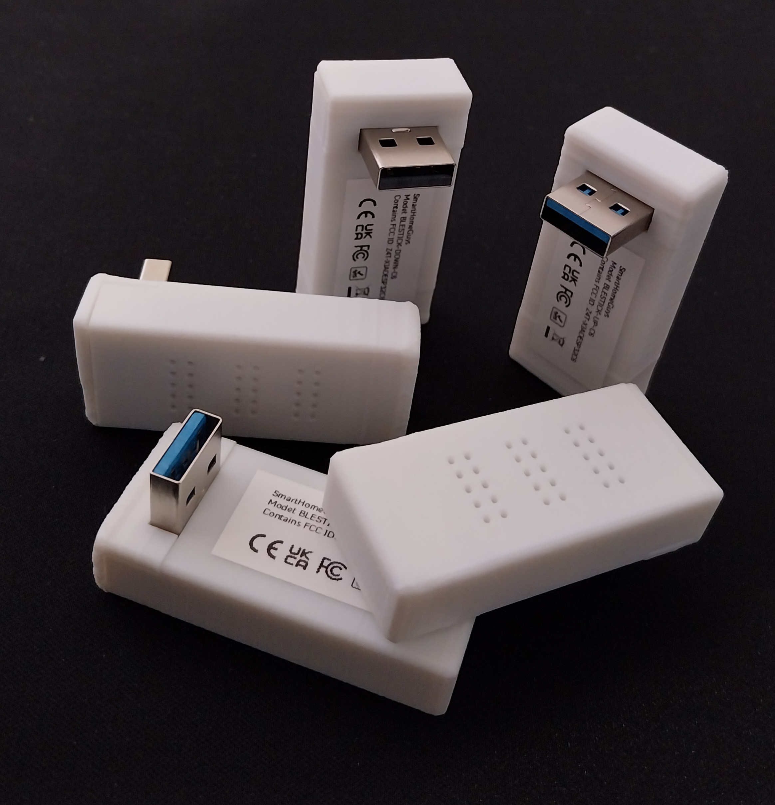
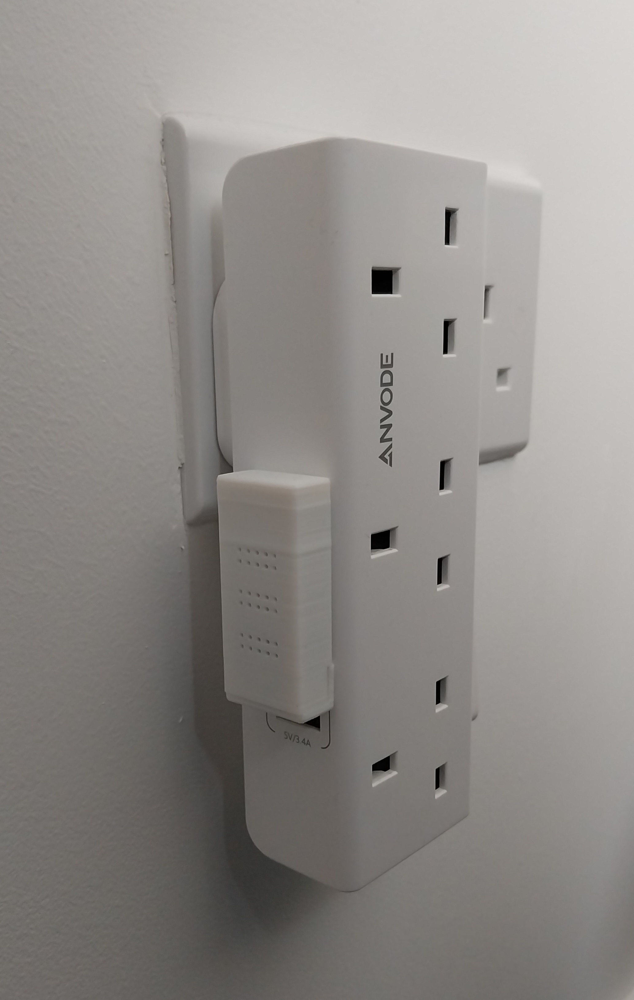
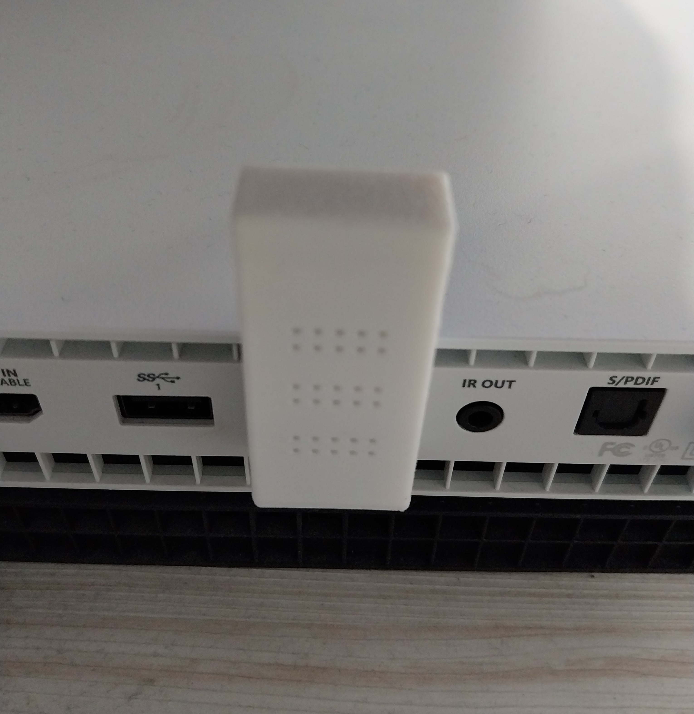

# Bluetooth Proxy Stick for Home Assistant 

<table border="0">
  <tr>
    <td><a href="docs/setup">Setup</a></td>
    <td><a href="docs/configuration">Configure</a></td>
  </tr>
</table>

This compact Bluetooth (BLE) Proxy is designed for Home Assistant and plugs directly into any USB‑A port—no cables required. It’s a simple, tidy way to extend Bluetooth coverage around your home.

  
  
  
  
  

Available in three versions on our eBay site:
 - USB-A straight
 - USB-A right angle pointing up
 - USB-A right angle pointing down

  

Modern homes have USB ports everywhere—on wall sockets, TVs, game consoles, routers, and extension leads. This proxy plugs straight in for a clean, cable‑free look, perfect for keeping things neat.

The right‑angle versions are especially useful for wall sockets with USB‑A ports, keeping the device against the wall instead of sticking outward.

We designed these to look good, be as small as possible and blend in with your home.

### Why do I need a Bluetooth Proxy?

- A Bluetooth Proxy connects to Home Assistant over Wi-Fi allowing you to place it nearer to your Bluetooth devices
- Ideal for hardware like Home Assistant Green that does not have Bluetooth built-in, a proxy provides it that functionality
- Enables integration with Bluetooth devices such as Switchbot that communicate over Bluetooth
- Many smart devices use BLE for their initial setup - a proxy makes detection fast and reliable
- Extend Bluetooth coverage in your house by placing multiple proxies in key locations.  2 or 3 proxies should cover a 2 story 4 bedroom UK new build house (built with brick/plaster board walls) with a garage on the side. A Bluetooth signal goes through walls and ceilings.
- Works with the Bermuda or ESPresence integrations in Home Assistant for room level presence detection of phones, watches, fitness trackers and iBeacons

### Automation Ideas
Once Bluetooth devices are added to Home Assistant, you can use them in automations. With presence based integrations like Bermuda you can also:
- Automatically adjust your Home Assistant dashboard based on the room you are in (you may need a Bluetooth proxy in each room for this so your phone locks onto the strongest Bluetooth Proxy's signal).
- Track waste/recycling bin collections using ibeacons and get reminders if they haven't been put out.
- Attach an ibeacon to your keys and know which room you left them in.

### Specs
- Built using only certified components from trusted suppliers to ensure the reliability needed for 24/7/365 operation.
- Powered by the new ESP32-C6 chip that has 2 processors which is ideal for Bluetooth Proxies using Wi-Fi.
- Plugs directly into a USB port, no external cable is needed.
- Firmware of the device uses ESPHome flashed with version >=2025.11.4 (which introduced many Bluetooth improvements).
- Uses 2.4ghz Wi-Fi.
- Initial setup of the device to connect it to Wi-Fi can be done using USB or Bluetooth BLE (if your Home Assistant instance already has Bluetooth capability).
- We have optimised the Bluetooth settings but if you want to customise it, adopt it in ESPHome and flash any changes you need to it, all the code is available free to use on our GitHub site.

We designed this product to look good wherever you place it in your home, offering multiple versions so you can choose the one that fits your space best. It’s built around the modern ESP32‑C6 chip and is assembled in the UK using only certified components for reliable performance.
